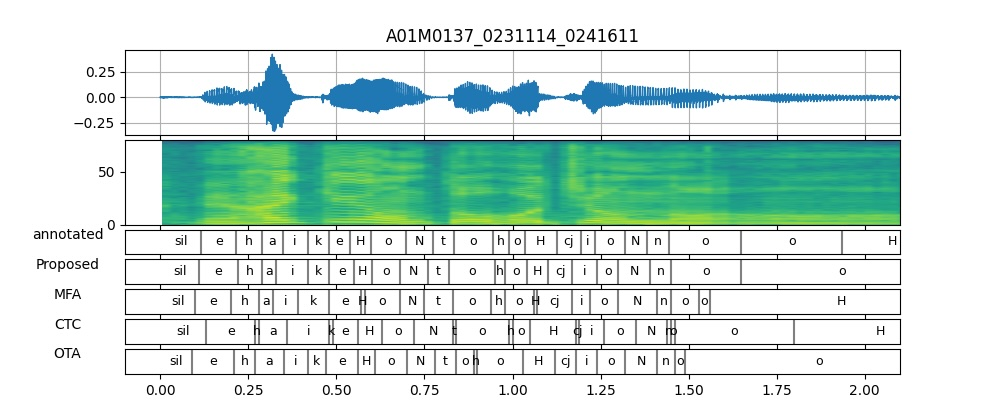

# VAE-based Phoneme Alignment Using Gradient Annealing and SSL Acoustic Features

Accepted to INTERSPEECH 2024
[arXiv preprint](https://arxiv.org/abs/2407.02749)

Sample code will be available soon.

## Alignment examples
- annotated: Manually annotated phoneme boundaries in the corpus
- Proposed: Predicted boundaries using proposed method
- MFA: Predicted boundaries using Montreal Forced Aligner
- CTC: Predicted boundaries using CTC forced alignment
- OTA: Predicted boundaries using "One TTS alignment to rule them all"

